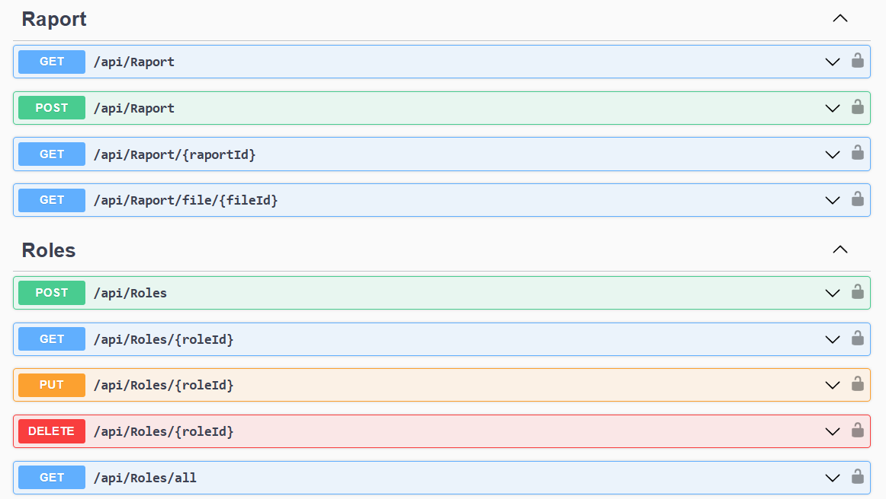

# Master Project

The project is a web application consisting of three microservices, each of which performs the functions assigned to it.

**Microservices description**

1. Python Api - Responsible for retrieving statistics from the Youtube platform, for selected videos, and creating a summary of these. In addition to this, the service is responsible for supporting the Assemly AI model, allowing Speech-To-Text transcription and subtitle generation for selected youtube videos.
2. C# .NET Api - This service is responsible for handling sessions, users and issuing the corresponding POST, PUT, PATCH, DELETE, GET methods from the MS SQL Server database system.
3. Angular - The service responsible for visualising and supporting the front end of the application.

All services include a log system to allow easy debugging and troubleshouting of the application, should the need arise.

**External resources used in the project**

- Assembly AI (requires API key),
- Google Cloud API (requires API key),
- Gmail API (Requires google authentication),

**Technologies worth mentioning**

- RxJS (front),
- Ngrx Store (front),
- Angular Materials (front),
- Entity Framework (C# .NET),

# Front application - overview

# Database Scheme

# List of C# .NET Shared endpoints

# List of Python Api endpoints

