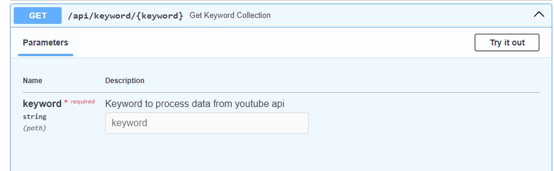
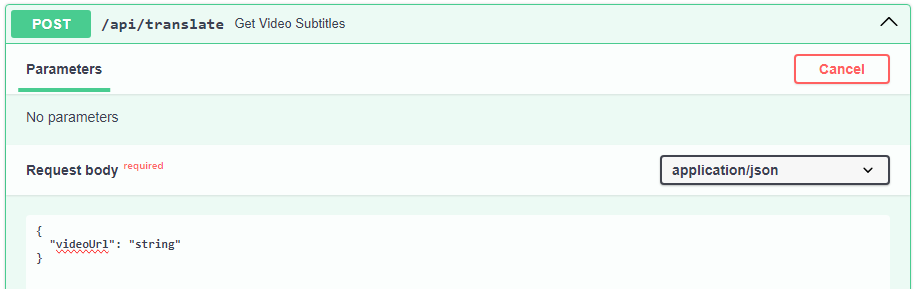

# Python API

**Actions**\
The api exposed in Python allows the following actions:
1. Generation of statistics for last week's videos by provided keyword.
2. Generation of subtitles for a video given as youtube video url.

**Endpoints**
```
/api/keyword/{search_keyword} - Generation of statistics
```

```
/api/translate - Generation of subtitles for a film specified as a parameter
```


**Service description**\
In order to launch the service, the following steps must be taken:
1. Install pip packages defined in the requirements.txt file,
2. Starting a live-server by using the uvicorn command.

_Installing pip packages_
```
pip -r requirements.txt
```

_Starting live-server_
```
uvicorn main:app --reload
```
