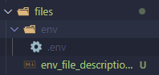
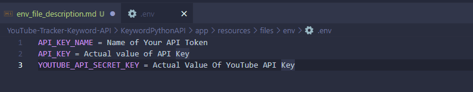

# Files Directory Structure
**Directory Structure**

**Directory Description**
Inside the files directory, for the correct operation of the api, a directory named env must be created, with an .env file.

# What the .env file should contain?
**Variables Structure**

**Variables Description**
The .env configuration file should contain the following variables:
1. **API_KEY_NAME** - Token name for your API.
2. **API_KEY** - API key value.
3. **YOUTUBE_API_SECRET_KEY** -  The value of the YouTube API key.
