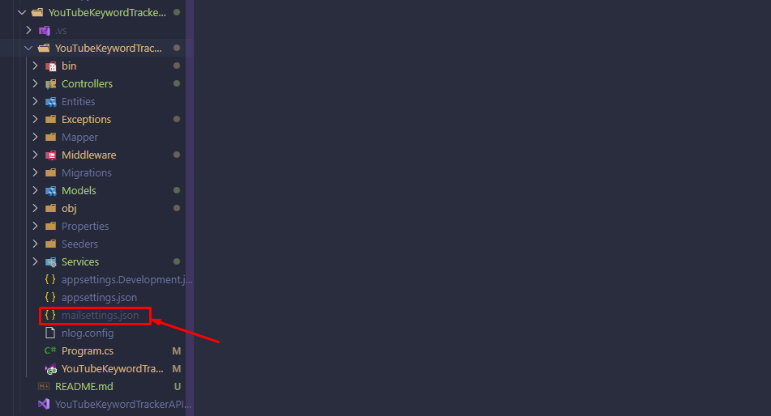

# Api Set up
**Description**\
In order to use the api correctly, it is necessary to create a file called _mailsettings.json_.

**Directory structure**\


The structure of the file is as follows and is shown below.
```
{
  "SmtpServer": Your smtp server string,
  "Port": Your server port as number,
  "Username": Name of your mailbox as string,
  "Password": Password to your mailbox as string
}
```

