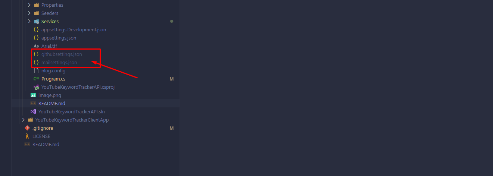

# Api Set up

**Description**\
In order to use the api correctly, it is necessary to create a file called _mailsettings.json_.
Next file you need to create is _githubsettings.json_.

**Directory structure**\


The structure of the file _mailsettings.json_ is as follows and is shown below.

```
{
  "SmtpServer": Your smtp server string,
  "Port": Your server port as number,
  "Username": Name of your mailbox as string,
  "Password": Password to your mailbox as string
}
```

Structure of _githubsettings.json_ looks like below.

```
{
  "Token": Github personal access token,
  "Encoding": "gzip, deflate, br",
  "Accept": "*/*",
  "GithubApiVersion": Current github api version,
  "UserAgent": Agent type of your client
}
```
